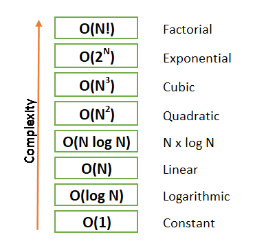

# 0x1B. C - Sorting algorithms & Big O

### Table of Complexity Comparison:

|                      _Name_                      | _Best Case_ | _Average Case_ | _Worst Case_ | _Memory_ |
|:------------------------------------------------:|:-----------:|:--------------:|:------------:|:--------:|
|          [Bubble Sort](0-bubble_sort.c)          |     `n`     |      `n²`      |     `n²`     |   `1`    |
|    [Insertion Sort](1-insertion_sort_list.c)     |     `n`     |      `n²`      |     `n²`     |   `1`    |
|       [Selection Sort](2-selection_sort.c)       |    `n²`     |      `n²`      |     `n²`     |   `1`    |
|           [Quick Sort](3-quick_sort.c)           |  `nlog(n)`  |   `nlog(n)`    |     `n²`     | `log(n)` |
|          [Shell sort](100-shell_sort.c)          |  `nlog(n)`  |   `nlog(n)`    |     `n²`     |   `1`    |
| [Cocktail shaker sort](101-cocktail_sort_list.c) |     `n`     |      `n²`      |     `n²`     |   `1`    | 
|       [Counting sort](102-counting_sort.c)       |   `n + k`   |    `n + k`     |   `n + k`    |   `k`    |
|          [Merge sort](103-merge_sort.c)          |  `nlog(n)`  |   `nlog(n)`    |  `nlog(n)`   |   `n`    |
|          [Radix sort](105-radix_sort.c)          |    `nk`     |      `nk`      |     `nk`     |   `n`    |
|        [104-heap_sort.c](104-heap_sort.c)        |  `nlog(n)`  |   `nlog(n)`    |  `nlog(n)`   |    1     |

**Note:**

1. `n` represents the number of elements in the input array.
2. `k` represents the range of values in the input array.

    
    

